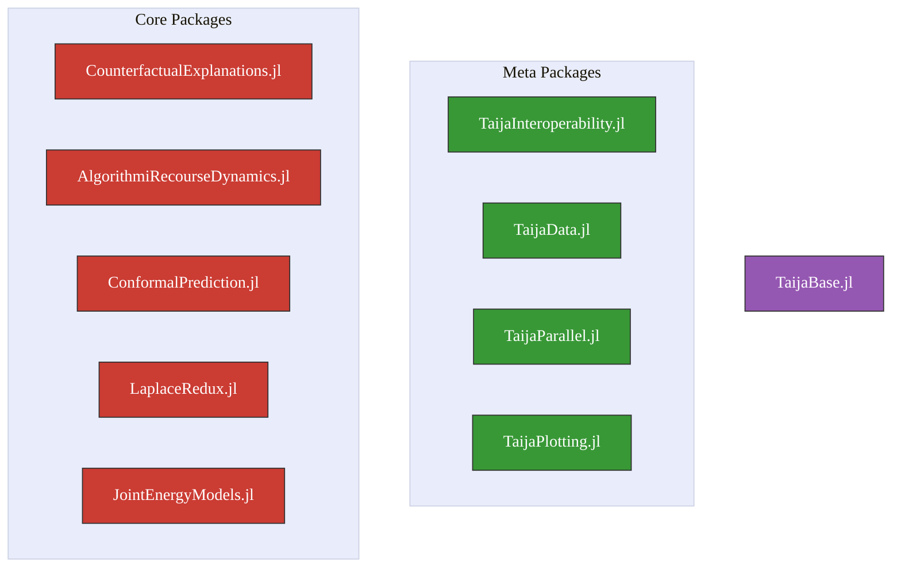

# Taija

Taija is the organization that hosts software geared towards Trustworthy Artificial Intelligence in Julia.

> \[!TIP\]
> Find more relevant information and Taija’s blog at [www.taija.org](https://www.taija.org/).

## About

Taija currently covers a range of approaches towards making AI systems more trustworthy:

- Model Explainability ([CounterfactualExplanations.jl](https://github.com/JuliaTrustworthyAI/CounterfactualExplanations.jl))
- Algorithmic Recourse ([CounterfactualExplanations.jl](https://github.com/JuliaTrustworthyAI/CounterfactualExplanations.jl), [AlgorithmicRecourseDynamics.jl](https://github.com/JuliaTrustworthyAI/AlgorithmicRecourseDynamics.jl))
- Predictive Uncertainty Quantification ([ConformalPrediction.jl](https://github.com/JuliaTrustworthyAI/ConformalPrediction.jl), [LaplaceRedux.jl](https://github.com/JuliaTrustworthyAI/LaplaceRedux.jl))
- Effortless Bayesian Deep Learning ([LaplaceRedux.jl](https://github.com/JuliaTrustworthyAI/LaplaceRedux.jl))
- Hybrid Learning ([JointEnergyModels.jl](https://github.com/JuliaTrustworthyAI/JointEnergyModels.jl))

Various meta packages can be used to extend the core functionality:

- Plotting ([TaijaPlotting.jl](https://github.com/JuliaTrustworthyAI/TaijaPlotting.jl))
- Datasets for testing and benchmarking ([TaijaData.jl](https://github.com/JuliaTrustworthyAI/TaijaData.jl))
- Parallelization ([TaijaParallel.jl](https://github.com/JuliaTrustworthyAI/TaijaParallel.jl))
- Interoperability with other programming languages ([TaijaInteroperability.jl](https://github.com/JuliaTrustworthyAI/TaijaInteroperability.jl))

The [TaijaBase.jl](https://github.com/JuliaTrustworthyAI/TaijaBase.jl) package provides common symbols, types and functions that are used across all or multiple Taija packages.

> Why *Taija*?

Taija stands for **T**rustworthy **A**rtificial **I**ntelligence in **J**uli**a**. When thinking about a logo that embodies trustworthiness, we quickly landed on 🐶.

## Contribute

We welcome contributions of any kind. If you want to get involved or use our software for or project, please feel free to reach out. If you have questions, comments or issues related to specific packages, please feel free to open issues or discussions on the respective repository.

#### Working on related projects?

Are you working on a Julia package that would fit well into this organization? Or do you perhaps have ideas for future projects? We’d love to hear about it, so please do get in touch!

## Research using Taija

Taija has been used in the following publications:

- *Conformal Intent Classification and Clarification for Fast and Accurate Intent Recognition* (Hengst et al. 2024) [upcoming](https://arxiv.org/abs/2403.18973) in ACL’s NAACL Findings 2024[^1].
- *Faithful Model Explanations through Energy-Constrained Conformal Counterfactuals* (Altmeyer et al. 2024) [published](https://ojs.aaai.org/index.php/AAAI/article/view/28956) in Proceedings of the AAAI Conference on Artificial Intelligence 2024.
- *Explaining Black-Box Models through Counterfactuals* (Altmeyer, Deursen, et al. 2023) [published](https://proceedings.juliacon.org/papers/10.21105/jcon.00130) in JuliaCon Proceedings.
- *Endogenous Macrodynamics in Algorithmic Recourse* (Altmeyer et al. 2023) [published](https://ieeexplore.ieee.org/abstract/document/10136130) in Proceedings of the 2023 IEEE Conference on Secure and Trustworthy Machine Learning (SaTML).

If you have used Taija in your research, please let us know so we can add your publication to the list.

## Sponsors

Some of Taija’s contributors have been partially or fully funded by one or more of the following entities:

<table width="100%">
<tr>
<td  width="50%">
    
  </td>
<td width="50%">

</td>
</tr>
</table>

## Related Software

Our packages are currently tailored towards the following larger package ecosystems for AI and machine learning in Julia:

- [FluxML](https://fluxml.ai/Flux.jl/stable/)
- [MLJ](https://alan-turing-institute.github.io/MLJ.jl/dev/)

Other external packages and ecosystems related to Trustworthy AI in Julia include:

- [Julia-XAI](https://github.com/Julia-XAI)
- [ShapML.jl](https://github.com/nredell/ShapML.jl)

## Contact

Probably the easiest way is to join the [JuliaLang Slack](https://julialang.org/slack/) and join our \#taija channel. You can also post a GitHub Issue on our organization [repo](https://github.com/JuliaTrustworthyAI/.github/issues). You can find [@pat-alt](https://github.com/pat-alt)’s socials and contact details on his website: [www.patalt.org](www.patalt.org).

## 🎓 References

Altmeyer, Patrick, Giovan Angela, Aleksander Buszydlik, Karol Dobiczek, Arie van Deursen, and Cynthia CS Liem. 2023. “Endogenous Macrodynamics in Algorithmic Recourse.” In *2023 IEEE Conference on Secure and Trustworthy Machine Learning (SaTML)*, 418–31. IEEE.

Altmeyer, Patrick, Arie van Deursen, et al. 2023. “Explaining Black-Box Models Through Counterfactuals.” In *Proceedings of the JuliaCon Conferences*, 1:130. 1.

Altmeyer, Patrick, Mojtaba Farmanbar, Arie van Deursen, and Cynthia CS Liem. 2024. “Faithful Model Explanations Through Energy-Constrained Conformal Counterfactuals.” In *Proceedings of the AAAI Conference on Artificial Intelligence*, 38:10829–37. 10.

Hengst, Floris den, Ralf Wolter, Patrick Altmeyer, and Arda Kaygan. 2024. “Conformal Intent Classification and Clarification for Fast and Accurate Intent Recognition.” <https://arxiv.org/abs/2403.18973>.

[^1]: Experiments were run in parallel using Python’s MAPIE and ConformalPrediction.jl, in order to cross-check results. Reported results were produced using MAPIE.
